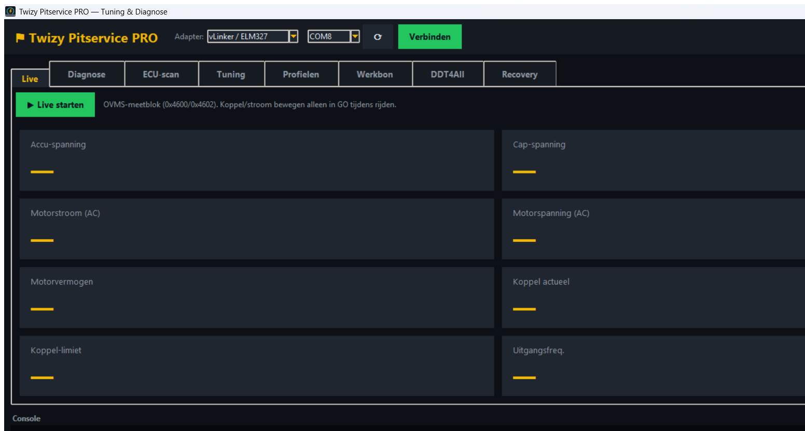
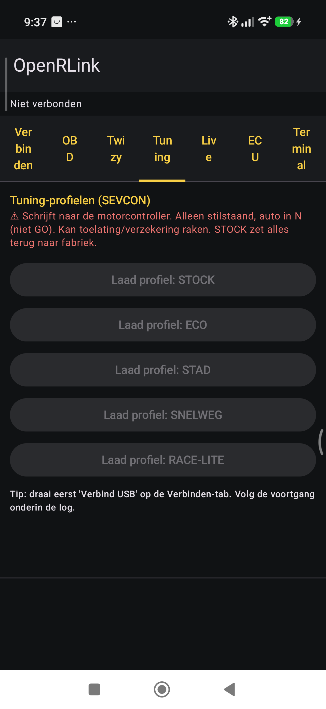

# Twizy Diagnose- & Tuning-Toolkit


[](https://github.com/rakkipe/twizy-diag-tuning/releases/latest)

Open-Source-Diagnose und -Tuning für den **Renault Twizy 80 (SEVCON Gen4)** über einen
vLinker- / ELM327-USB-CAN-Adapter. Zwei Apps mit derselben verifizierten Logik:

- **Twizy Pitservice PRO** — ein Windows-Werkstatt-Tool (Python/Tkinter)
- **OpenRLink** — eine Android-App (Kotlin/Compose) für Smartphone + OTG-Adapter

**Sprachen:** [🇬🇧 English](README.md) · [🇳🇱 Nederlands](README.nl.md) · [🇩🇪 Deutsch](README.de.md) · [🇫🇷 Français](README.fr.md)

---

## ⚠️ Haftungsausschluss — zuerst lesen

Diese Software schreibt Tuning-Parameter (Geschwindigkeit, Drehmoment, Strom, Rekuperation)
direkt in das Motorsteuergerät. Aggressive Profile treiben den Antriebsstrang **über die
Auslegungsgrenzen** und können Motor, Getriebe, Kupplung oder Batterie beschädigen und die
Reichweite stark verringern.

- Nutzung vollständig **auf eigene Gefahr**. Die Autoren übernehmen **keine Haftung** für
  Schäden, Verletzungen, Garantieverlust oder Zulassungs-/Versicherungsfolgen.
- Tuning, das Geschwindigkeit oder Leistung erhöht, kann das Fahrzeug für den **öffentlichen
  Straßenverkehr unzulässig** machen und die Versicherung erlöschen lassen. Gedacht für
  **abgesperrtes Gelände / Rennstrecke / Prüfstand**.
- Nur schreiben bei **stehendem Fahrzeug und in N (nicht GO)**, Zündung an.
- Dies ist **kein** offizielles Renault-Tool und steht in keiner Verbindung zu Renault oder SEVCON.

Wenn du dem nicht zustimmst, nutze die Software nicht.

---

## Screenshots

**Twizy Pitservice PRO (Windows)** — Live-Telemetrie-Tab:



**OpenRLink (Android)** — Tuning-Profile-Tab:



## Was es ist

Beide Apps kommunizieren mit dem **SEVCON Gen4** über **CANopen SDO** (Tuning + Live-
Telemetrie) und mit den übrigen Steuergeräten über **UDS/KWP über ISO-TP** (Fehlercodes
lesen). Die Register-Maps und Tuning-Berechnungen sind eine getreue Portierung der
Open-Source-Arbeit von
[OVMS](https://github.com/openvehicles/Open-Vehicle-Monitoring-System-3) /
[dexterbg Twizy-Cfg](https://github.com/dexterbg/Twizy-Cfg) — verifiziert, nicht erfunden.

## Verzeichnisstruktur

```
android/         OpenRLink — Android-App (Kotlin/Compose)
pc-tuning-gui/   Twizy Pitservice PRO — Windows-Python-App
windows/         älterer/experimenteller Python-Client (als Referenz)
docs/            Notizen
```

## Funktionen

- **Tuning-Profile**: STOCK, ECO, STADT/STAD, AUTOBAHN/SNELWEG, RACE-LITE (und 110 Nm / RACE am PC)
- **Live-Anzeigen** (OVMS 0x4600/0x4602): Batterie-/Kondensator-Spannung, Motorstrom/-spannung, Leistung, Drehmoment, Ausgangsfrequenz
- **Diagnose**: SEVCON-Status + aktive Fehler (CANopen), Multi-ECU-DTC-Scan (UDS/KWP)
- **Optionaler DTC-Text**: übersetzt Fehlercodes mit *deiner eigenen* DDT4All-Datenbank (siehe unten)
- PC-Extras: sicheres Backup-vor-dem-Schreiben, Arbeitsauftrag-Export, DDT4All-Starter

## Voraussetzungen

- Renault Twizy 80 mit **SEVCON-Gen4**-Steuergerät
- **vLinker FS / ELM327** USB-CAN-Adapter (STN empfohlen), 500 kbps
- PC-App: Windows + Python 3.8+ und `pyserial`
- Android-App: Android 8+ (minSdk 26), USB-OTG-Kabel

## Schnellstart — PC (Twizy Pitservice PRO)

```
cd pc-tuning-gui
python -m pip install pyserial
python Twizy_Pitservice_GUI.py      # oder run.bat doppelklicken
```
Adapter + COM-Port wählen → **Verbinden**. Tabs: Live, Diagnose, ECU-Scan, Tuning, Werkbon,
DDT4All, Recovery.

## Schnellstart — Android (OpenRLink)

Signierte APK installieren (selbst mit Android Studio / Gradle bauen oder eine Release-APK
verwenden). vLinker mit **OTG-Kabel** anschließen → **Verbinden → Verbind USB**. Tabs:
Twizy, Tuning, Live, ECU, Terminal.

> Das Bauen erfordert JDK 17 + Android SDK. Ein Release-Build benötigt deinen eigenen
> Signatur-Keystore (niemals committen — ist in `.gitignore`).

## ECU-Datenbank (ecu.zip) — optional, du lieferst sie

Die Apps funktionieren **ohne** Datenbank — der ECU-Scan zeigt dann die rohen DTC-Codes. Um
zusätzlich die **Klartext-Fehlerbeschreibungen** zu sehen, lesen die Apps eine DDT4All-
`ecu.zip`, die **du aus deiner eigenen DDT4All-Installation bereitstellst**.

> ⚖️ Die Renault-ECU-Datenbank (DDT2000) ist **proprietär**. Sie ist in diesem Repository
> **nicht** enthalten, und hier wird **kein** Download angeboten. Beschaffe sie nur auf
> legitimem Weg und nutze sie nur privat. `ecu.zip` steht bewusst in `.gitignore`.

**Wohin damit**
- **PC**: `ecu.zip` dorthin legen, wo die App sucht (standardmäßig `D:\downloads\ecu.zip`
  oder neben `Twizy_Pitservice_GUI.py`). Der ECU-Scan-Tab zeigt an, ob sie gefunden wurde.
- **Android**: ECU-Tab → **Kies ecu.zip** (System-Dateiauswahl) — die App kopiert sie in
  ihren eigenen Speicher und liest sie dort.

Die App *liest* deine Datei nur zur Laufzeit; sie bündelt oder verbreitet die Datenbank nie.

## Sicherheit — Kurzfassung

Stehend, in N, Zündung an. Zuerst ein Backup machen (PC). Mild beginnen (ECO/STADT),
steigern. Die Live-Anzeigen beobachten — sinkt die Spannung oder steigt die Temperatur,
regelt der SEVCON selbst zurück: das ist Schutz, kein Fehler. STOCK stellt die Werkswerte
wieder her.

## Danksagung

- [OVMS](https://github.com/openvehicles/Open-Vehicle-Monitoring-System-3) und
  [dexterbg Twizy-Cfg](https://github.com/dexterbg/Twizy-Cfg) — SEVCON-Register-Maps & Tuning-Mathematik
- [DDT4All](https://github.com/cedricp/ddt4all) — ECU-Datenbankformat (zur Laufzeit gelesen; nicht enthalten)

## Lizenz

MIT — siehe `LICENSE`. Bereitgestellt „wie besehen", ohne jegliche Gewährleistung. Die
MIT-Lizenz deckt nur den eigenen Code dieses Projekts ab, nicht eine Drittanbieter-Datenbank,
die du damit verwendest.

